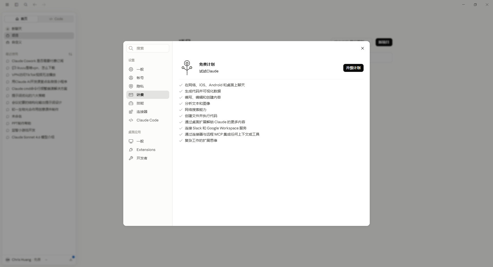
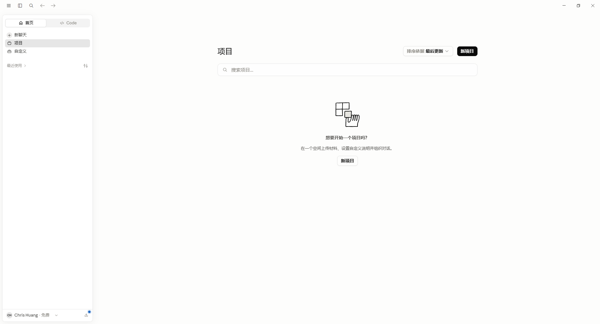
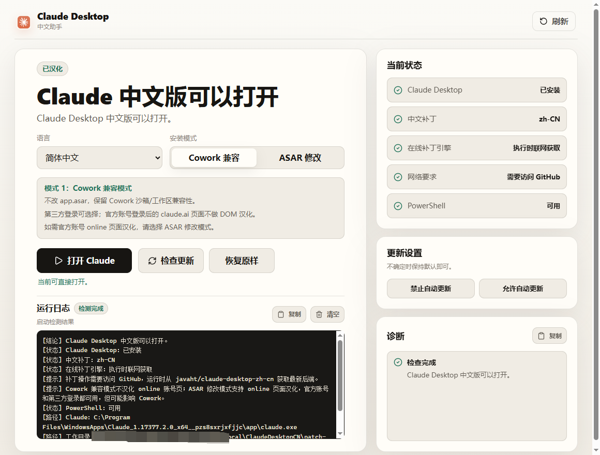
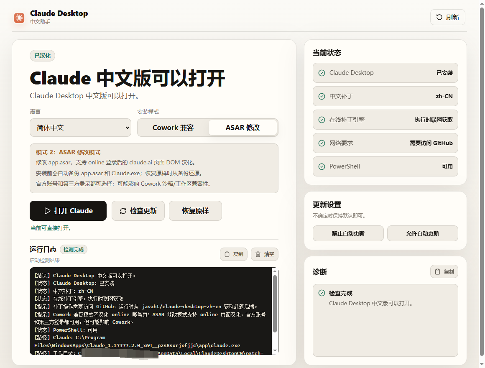
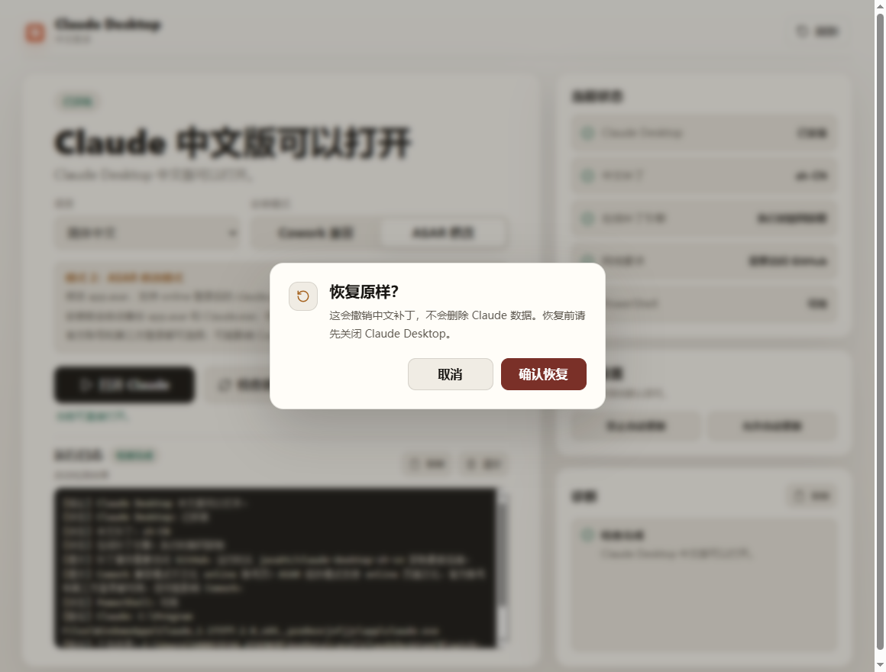
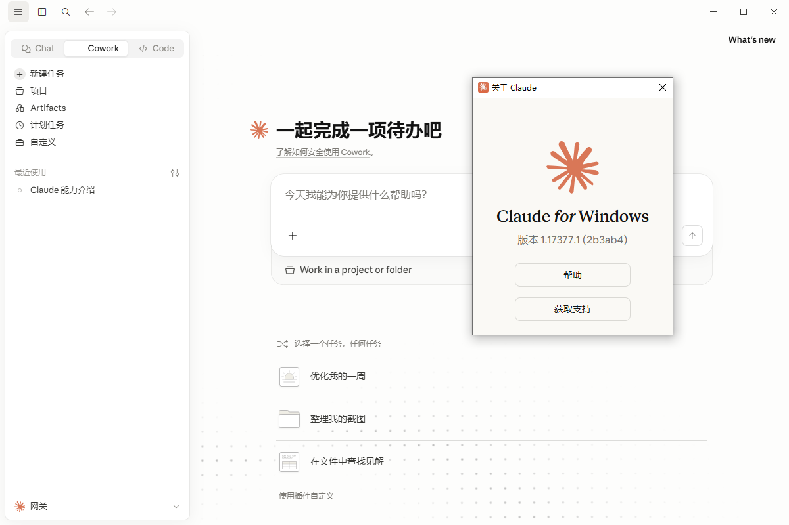

# Claude Desktop zh-CN for Windows

面向 Windows 用户的 Claude Desktop 中文绿色版工具，提供汉化、启动、状态检测、检查更新和一键修复。


## 效果图














## 功能

| 功能 | 说明 |
| --- | --- |
| 打开 Claude | 应用中文设置后启动 Claude Desktop 中文版 |
| 状态检测 | 检查中文版程序、打开入口、修复工具和 Python 环境 |
| 检查更新 | 使用 winget 获取 Claude Desktop 官方最新版本 |
| 一键修复 | 重新应用中文设置，并重建启动器和快捷方式 |
| 诊断信息 | 显示可读摘要，必要时展开复制技术细节 |

## 系统要求

- Windows 10 / 11
- Microsoft Edge WebView2 Runtime
- Python 3 或 `py` 启动器
- 可用的 winget，用于检查官方最新版本
- 可访问 GitHub 的网络，用于执行汉化补丁操作时获取最新后端

## 开发运行

```powershell
npm install
npm run tauri dev
```

仅预览前端界面：

```powershell
npm run dev
```

构建可运行程序：

```powershell
npm run tauri build
```

当前默认只生成 Windows 可运行 exe，不打 NSIS/MSI 安装包，避免构建时下载额外打包工具链。

## 验证

```powershell
npm run lint
npm run build
cd src-tauri
cargo fmt --check
cargo test
cargo check
```

## 汉化后端

本项目只提供 Windows 图形壳和本机操作入口，汉化后端运行时直接从 [javaht/claude-desktop-zh-cn](https://github.com/javaht/claude-desktop-zh-cn) 获取。

每次安装中文补丁、恢复原样或修改自动更新设置前，程序都会联网下载 javaht 仓库最新 `main.zip`，并解压到：

```text
%LOCALAPPDATA%\ClaudeDesktopCN\patch-engine
```

因此这些补丁操作需要用户保持网络可用。下载、解压或结构校验失败时，应用会显示明确错误，不会伪装成功。

## 安装模式说明

本项目沿用 javaht 后端的两种 Windows 安装模式：

| 模式 | 适合场景 | 说明 |
| --- | --- | --- |
| 模式 1：Cowork 兼容 | 需要保留 Cowork 沙箱 / 截图工作区 | 跳过 `app.asar` 补丁，online 登录后的 `claude.ai` 页面不做 DOM 汉化。第三方模型请通过网关或 `ccswitch` 做模型别名映射。 |
| 模式 2：ASAR 修改 | 需要 online 页面 DOM 汉化 | 会修改当前 Claude 的 `app.asar`，覆盖聊天、项目、Artifacts 等远程页面；官方账号和第三方登录都可选择。该模式可能触发完整性 / 签名校验问题，影响 Cowork 沙箱 / 工作区兼容性。 |

如果你主要使用 Cowork、截图工作区或对客户端完整性校验敏感，优先选择模式 1。如果你更需要 online 登录后的页面汉化，再选择模式 2。

## Legacy 入口

`launcher/` 目录保留早期 PowerShell 启动入口，作为 Tauri 应用之外的兜底方案。

## 致谢

🙏 感谢 [LINUX DO](https://linux.do/) 社区的支持与讨论。

感谢 [javaht/claude-desktop-zh-cn](https://github.com/javaht/claude-desktop-zh-cn)。

## 免责声明

“Claude” 是 Anthropic PBC 的商标。本项目是第三方中文体验工具，不代表与 Anthropic 存在官方从属关系。

## License

[MIT](LICENSE)
