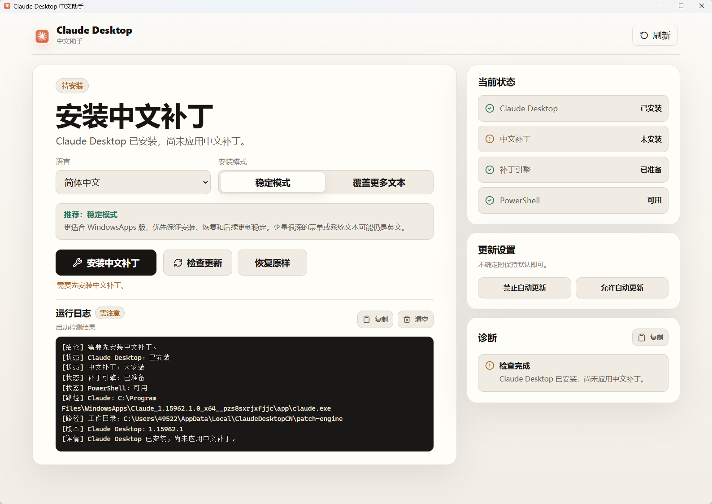
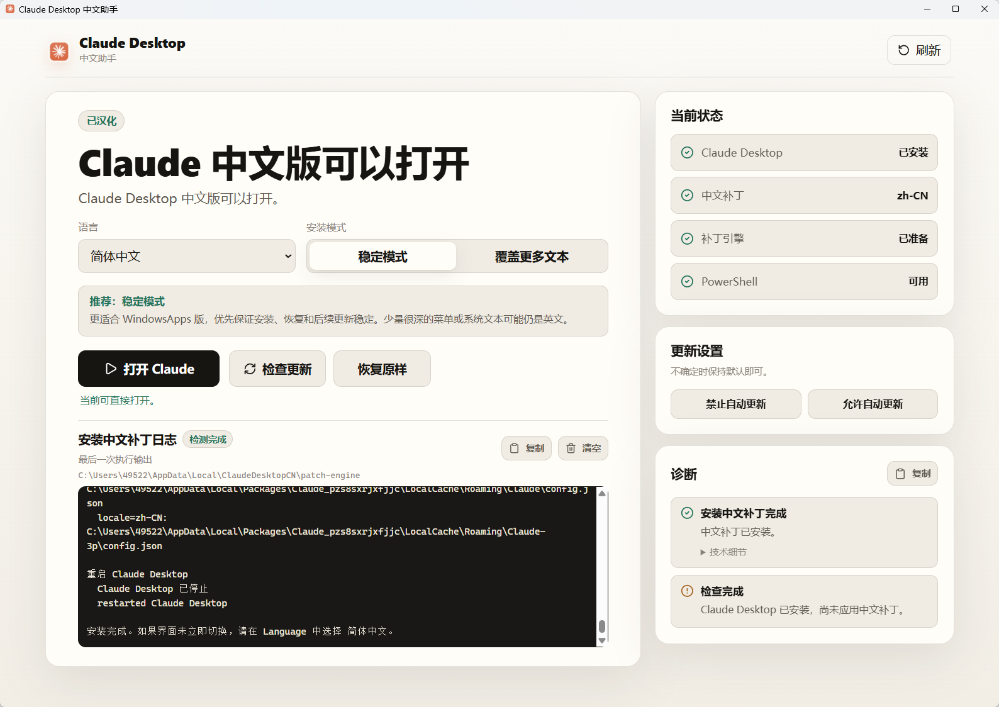
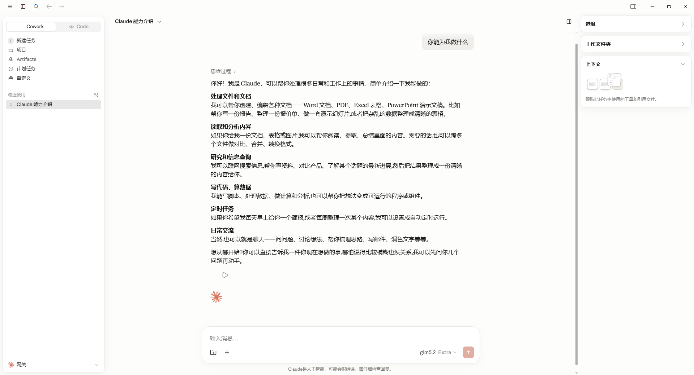
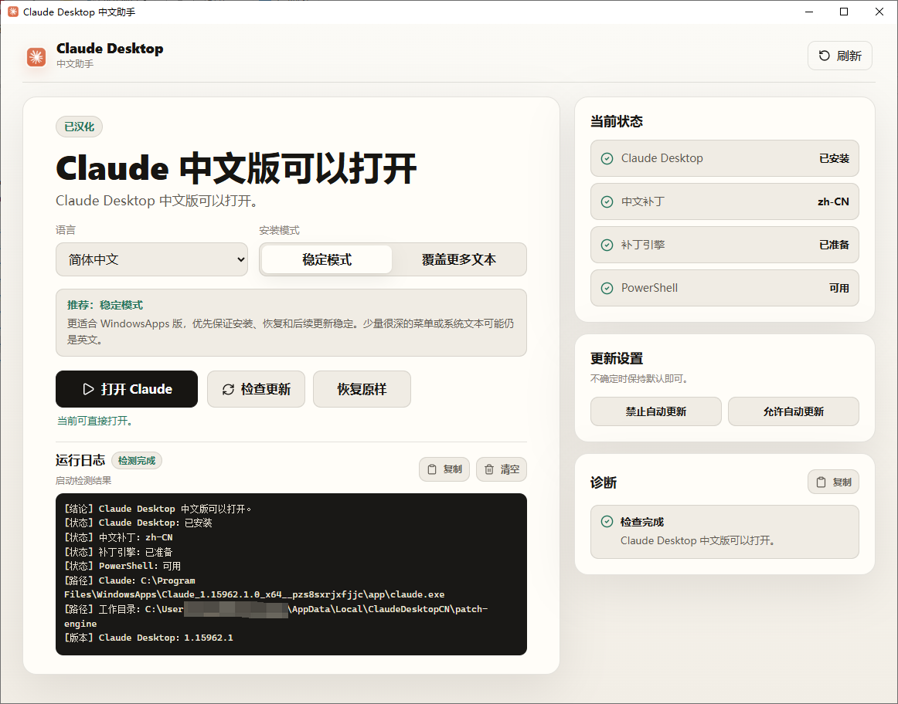
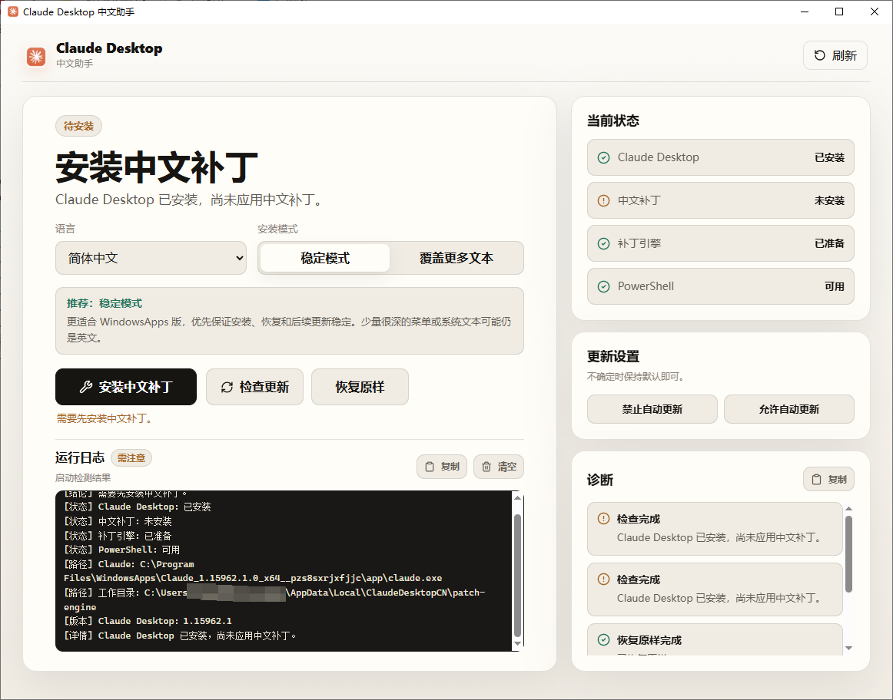
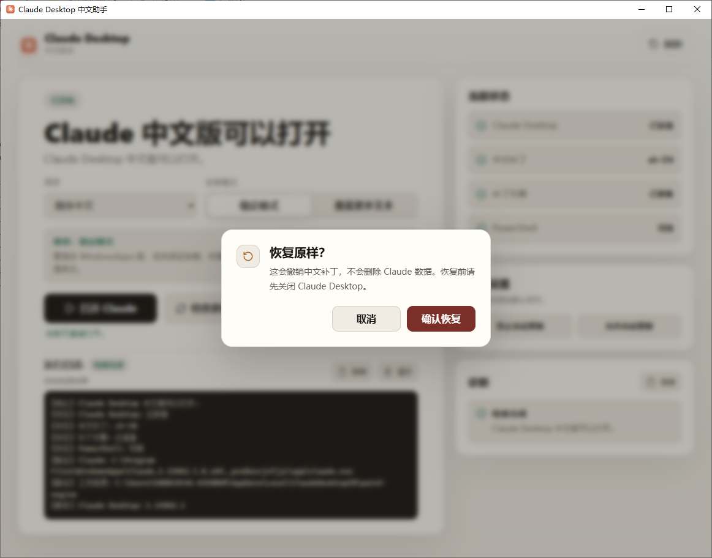
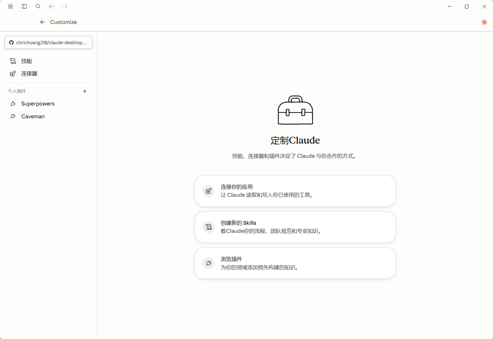
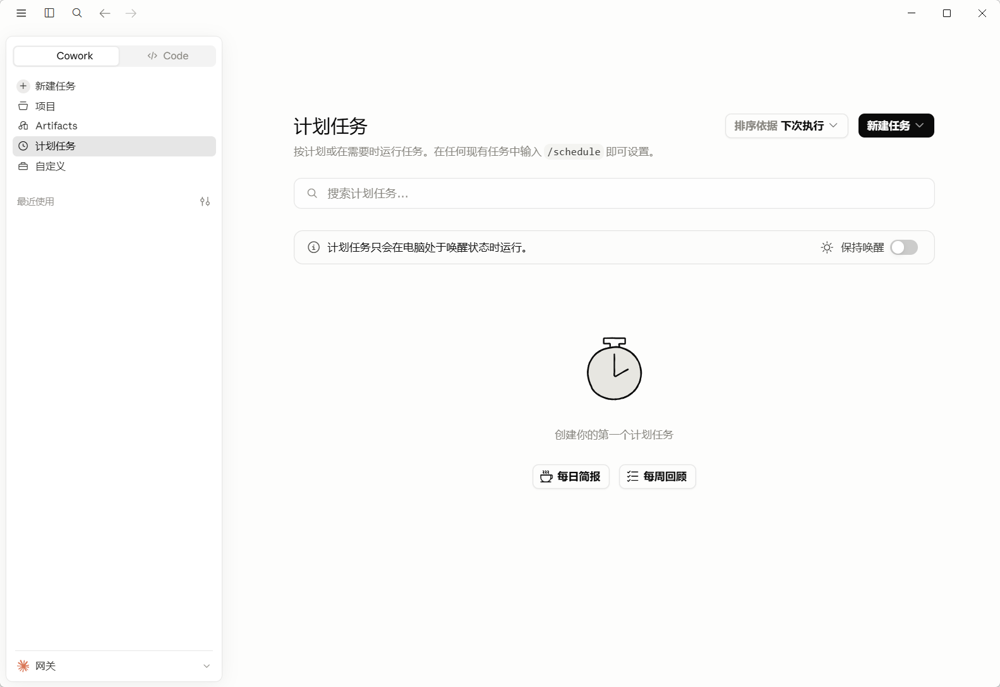

# Claude Desktop zh-CN for Windows

面向 Windows 用户的 Claude Desktop 中文绿色版工具，提供汉化、启动、状态检测、检查更新和一键修复。


## 效果图

















## 功能

| 功能 | 说明 |
| --- | --- |
| 打开 Claude | 应用中文设置后启动 Claude Desktop 中文版 |
| 状态检测 | 检查中文版程序、打开入口、修复工具和 Python 环境 |
| 检查更新 | 使用 winget 获取 Claude Desktop 官方最新版本 |
| 一键修复 | 重新应用中文设置，并重建启动器和快捷方式 |
| 诊断信息 | 显示可读摘要，必要时展开复制技术细节 |

## 系统要求

- Windows 10 / 11
- Microsoft Edge WebView2 Runtime
- Python 3 或 `py` 启动器
- 可用的 winget，用于检查官方最新版本

## 开发运行

```powershell
npm install
npm run tauri dev
```

仅预览前端界面：

```powershell
npm run dev
```

构建可运行程序：

```powershell
npm run tauri build
```

当前默认只生成 Windows 可运行 exe，不打 NSIS/MSI 安装包，避免构建时下载额外打包工具链。

## 验证

```powershell
npm run lint
npm run build
cd src-tauri
cargo fmt --check
cargo test
cargo check
```

## 汉化引擎

发布版 exe 内置 `claude-desktop-zh-cn` 补丁引擎。首次安装或修复中文补丁时，程序会优先释放内置引擎到：

```text
%LOCALAPPDATA%\ClaudeDesktopCN\patch-engine
```

如果当前构建没有内置补丁引擎，程序会从 [javaht/claude-desktop-zh-cn](https://github.com/javaht/claude-desktop-zh-cn) 下载作为兜底。下载或释放失败时，应用会显示明确错误，不会伪装成功。

## Legacy 入口

`launcher/` 目录保留早期 PowerShell 启动入口，作为 Tauri 应用之外的兜底方案。

## 致谢

🙏 感谢 [LINUX DO](https://linux.do/) 社区的支持与讨论。

感谢 [javaht/claude-desktop-zh-cn](https://github.com/javaht/claude-desktop-zh-cn)。

## 免责声明

“Claude” 是 Anthropic PBC 的商标。本项目是第三方中文体验工具，不代表与 Anthropic 存在官方从属关系。

## License

[MIT](LICENSE)
